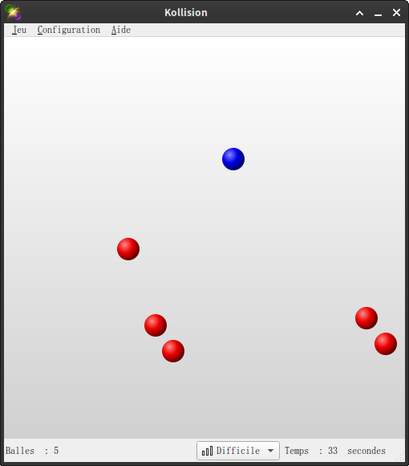

# Kollision, un jeu de réaction

L'objectif de ce problème est de programmer en Python le jeu classique de
Kollision (disponible sur les machines à l'université), où le joueur contrôle
une boule dans un carré fermé avec des autres boules en mouvement perpétuel. Le 
but du joueur est d'éviter la collision avec les autres boules le plus longtemps
possible.

Attention, il y a *énormément* de possibilités d'amélioration. Il est
impossible de toutes les implémenter. Soignez bien la version de base du jeu
avant de vous lancer dans de nouvelles fonctionnalités, et choisissez bien
lesquelles cous souhaitez implémenter !

## Mécanisme général

Le jeu commence dès que le joueur clique sur la fenêtre, dans laquelle 4
boules rouges sont générées, avec position et vitesse aléatoires. Il y aura
aussi une boule bleue qui se déplace en même temps que le pointeur de souris.
La boule bleue survit tant qu'elle ne rentre pas en collision avec les boules
rouges, et la durée de survie est chronométrée et affichée. Tous les 30
secondes, une nouvelle boule rouge est ajoutée, toujours avec position et
vitesse aléatoires. Dès que la boule bleue rentre en collision avec une boule
rouge, le jeu se termine, et le résultat (temps de survie) est affiché.
L'utilisateur peut recommencer une autre partie en cliquant sur la fenêtre.

Pour l'affichage, pour assurer une visualisation fluide, il faut bien
contrôler le nombre d'images par seconde. Une valeur souvent utilisée est de
mettre à jours les positions des boules **60** fois par seconde (autrement dit
une mise à jours toutes les 1/60 s précisément). Entre chaque mise à jour, il
faut calculer les nouvelles positions des boules, qui peuvent être modifiées
pour deux raisons : le mouvement rectiligne dû à la vitesse de la boule, qui
est facile à calculer, et la collision avec un autre objet (qui peut aussi
changer sa direction et sa vitesse), qui demande un effort.

Pour détecter les collisions, à chaque mise à jour on vérifie s'il y a des
boules qui rentrent en collision avec un bord ou les unes avec les autres. Si
la distance entre le centre d'une boule et le bord du terrain est inférieure
au rayon de la boule, ou si la distance entre les centres de deux boules
différentes est inférieure à la somme de leurs rayons, alors il y a une
collision.

Pour calculer les changements suite à la collision, il y a deux façons de
faire :

- Façon facile mais imprécise : calculer la nouvelle vitesse à partir de la
  position courante, même si la distance est strictement inférieure à la vraie
  distance de collision (ce qui signifie que la collision aurait du déjà se
  passer entre deux mises à jour).
- Façon plus difficile mais précise (optionnelle) : calculer la nouvelle
  vitesse **et** la nouvelle position de manière plus réaliste, en tenant
  compte de la proportion du déplacement normal qui peut s'effectuer avant
  collision, et de la proportion restante après collision. Avec un peu de
  réflexion, ce n'est pas trop difficile à faire pour les rebonds sur un bord,
  mais nettement plus pour les collisions entre les boules.

## Mode de mouvement de base des boules rouges

Pour rendre les choses plus intéressantes, outre régler la vitesse initiale,
on constate qu'il peut y avoir plusieurs modes de mouvement pour les boules
rouges, qui rendront le jeu plus ou moins difficile.

À chaque fois qu'une boule rouge rencontre le bord de la fenêtre, elle doit
rebondir. Attention, une boule rencontre le bord **avant** que son centre se
retrouve sur le bord ! Ainsi, les boules rouges restent toujours dans le
périmètre de la fenêtre. D'autres mécanismes peuvent s'ajouter aux rebonds sur
les bords.

- "_gazeux_" : Aucune interaction entre les boules rouges (sans collision).
- "_solide_" : Quand les boules rouges se rencontrent, leurs trajectoires sont
  modifiées par la collision.

L'utilisateur doit pouvoir choisir le mode en passant un paramètre avec
l'option `--mode` ou `-m`. En absence de ce paramètre, l'utilisateur doit
pouvoir choisir le mode par le biais de l'interface graphique (appui sur une
touche du clavier ou clic sur un bouton).

## Autres modes de mouvement des boules rouges (optionnel)

On peut également envisager d'autres modes de mouvement (optionnels) qui
peuvent s'ajouter aux modes précédents :

- "_pesanteur_" : En plus des collisions, les boules rouges subissent aussi
  une accélération constante vers le bas imitant l'effet de la force de
  pesanteur.
- "_électrique_" : Les boules rouges ont toutes une charge électrique positive
  fixée, qui les mène à se repousser l'une l'autre. Cependant, même avec cette
  interaction, il est possible que les boules rouges se heurtent quand elles
  se rapprochent à grande vitesse. On peut également envisager dans ce mode
  que la boule du joueur soit porteuse d'une charge électrique négative, et
  attire les boules rouges passant aux alentours !
- "_torique_" : Dans ce mode, on identifie les bords parallèles en se disant
  qu'une boule qui dépasse le bord supérieur se retrouve au bord inférieur, et
  idem pour les bords à gauche et à droite. Attention, pour une boule qui se
  trouve partiellement au-delà d'une bord, il faut afficiher les deux parties
  à la fois : la partie qui dépasse, mais aussi la partie qui ne dépasse pas !
- "_gravitation universelle_" : Tous les objets de la fenêtre s'attirent les
  uns les autres proportionnellement à leur masse et à l'inverse du carré de
  leur distance.
- "_vent_" : toutes les boules rouges sont soumises à un vent uniforme (mais
  éventuellement changeant) qui modifie leur vitesse.
- "_boules uniques_" : toutes les boules rouges possèdent des caractéristiques
  propres (diamètre, masse, charge électrique...)
- "_fission_" : quand deux boules rouges se rencontrent à vitesse élevée, la
  plus grosse se sépare en deux boules plus petites.
- "_fusion_" : quand deux boules rouges se rencontrent à vitesse élevée, elles
  fusionnent en une boule plus grosse.

Libre à vous d'imaginer des modes de mouvement encore plus fous.

## Mode de mouvement de la boule bleue (optionnel)

Dans la version de base du jeu Kollision, la boule bleue reste en permanence
sous le pointeur de la souris (quand celui-ci est au-dessus de la zone de
jeu). On peut cependant envisager de nombreux autres modes de contrôle de la
boule bleue :

- "_toutou_" : la boule bleue se dirige à tout moment vers le pointeur de la
  souris, à vitesse constante, et s'arrête quand elle rejoint le pointeur.
- "_clavier_" : le joueur ne contrôle plus la boule bleue avec le pointeur de
  la souris mais avec des touches du clavier (flèches, ZQSD ou autre).
- "_élastique_" : la boule bleue subit une attraction élastique en direction
  du pointeur de la souris : plus le pointeur est éloigné, plus elle accélère
  pour s'en rapprocher.
- "_vaisseau_" : le joueur pilote la boule bleue au clavier comme s'il
  s'agissait d'un vaisseau spatial (accélération, rotation... projectiles ?!).

Ici encore, votre imagination est la seule limite...

## Autres extensions optionnelles possibles (liste non exhaustive)

- Ajustement de difficulté du jeu en réglant la vitesse initiale et le délai
  d'apparition de chaque nouvelle boule, choix parmi plusieurs difficultés
  possibles.
- Affichage d'un compte à rebours lors de l'ajout d'une boule (et changement
  de mode éventuel).
- Enregistrement des meilleurs temps, catégorisé par mode et par difficulté.
- Cocotte minute : accélération progressive des boules rouges.
- Création de "bonus" que le joueur peut ramasser et qui donnent des avantages
  (invulnérabilité temporaire, ralentissement des boules rouges, destruction
  des boules rouges lors des collisions...)
- Mode "challenge" : Le mode de mouvement change aléatoirement parmi les modes
  existants tous les 30 secondes (lors de l'ajout d'une boule). Il faut
  afficher le mode courant dans ce cas là (en lettres ou avec un logo).
- Calcul précis des collisions entre boules et avec les bords.

## Récapitulatif (partie obligatoire)

Dans la version de base du problème, il vous est donc demandé d'implémenter :

- Les collisions simplifiées des boules rouges avec les bords et entre elles ;
- La possibilité de choisir le mouvement gazeux ou solide des boules rouges.

Par ailleurs le jeu doit être stable et agréable à jouer, et l'animation
fluide.

